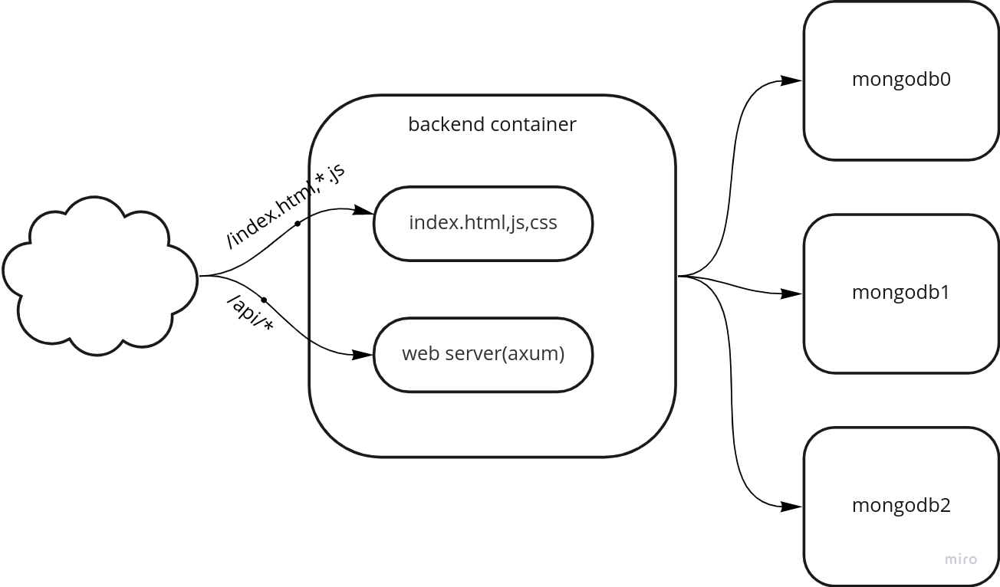

# Yet another TODO MVC
with rust,mongodb, parcel and svelte.


## Concept of the components


## Run with docker-compose
```bash
# run backend,mongo
docker-compose up -d

# run front
cd web
yarn install
yarn serve

# see localhost:1234
```

## Run on kind on your host machine
Install [kind](https://kind.sigs.k8s.io/)

the container image for web server will be fetched from [dockerhub](
https://hub.docker.com/repository/docker/tacogips/mongo-app-on-container-example)

```bash
cd infra/k8s

# create  cluster
kind create cluster --config=./kind/cluster.yaml

# switch clusterr
kubectl config use-context kind-mongo-app-example-cluster

# apply the manifest
make apply-kind

# see `localhost:30000`
```

